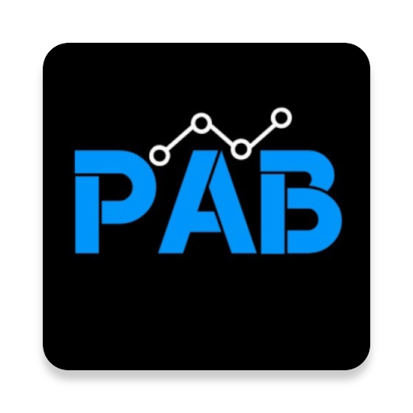

# 

## PAB
Nuestra propuesta como equipo es centralizar la información y brindar mayor comodidad y practicidad, tanto a los profesores como a los alumnos, evitando solapamiento de solicitudes, errores en las asignaciones y problemas de comunicación.
Así nace PAB, Programa para Alumnos Becados, una plataforma completa para el control de las tareas de apoyo no remuneradas de los alumnos becados de una universidad. Permite conectar adecuadamente a los alumnos becados con las tareas de apoyo propuestas por profesores u otros solicitantes, organizando toda la información necesaria mediante perfiles personales, notificaciones, solicitudes directas y listas homogéneas. 

## Creating
Encontrar un becario libre adecuado para que colabore con una actividad es muy difícil con el sistema actual. Surgen conflictos en la verificación de sus capacidades, sus proyectos actuales y la cantidad de horas sin asignar, lo que produce solapamientos de solicitudes y renovaciones mensuales incómodas de becarios asignados. Por el lado del alumno becado, éste suele recibir propuestas de manera individual, por lo que puede sentirse presionado a tomar horas en una actividad que no le interese mucho, a falta de otras opciones. 

## Capturas de pantalla

## Tecnologías utilizadas
<b>Desarrollado con</b>
- [Android SDK](https://developer.android.com/studio)
- [Firebase](https://firebase.google.com)

## Features
What makes your project stand out?

## Code Example
Show what the library does as concisely as possible, developers should be able to figure out **how** your project solves their problem by looking at the code example. Make sure the API you are showing off is obvious, and that your code is short and concise.

## Tests
Describe and show how to run the tests with code examples.

## How to use?
If people like your project they’ll want to learn how they can use it. To do so include step by step guide to use your project.

## Créditos
Gracias a los colaboradores, quienes hicieron posible la realización de dicho proyecto. 
- [estanislao-oviedo]()
- [gbarbieripederiva]()
- [jtallar]()
- [JulianVuoso]()
- [mbrula]()
- [mgalderisi]()
